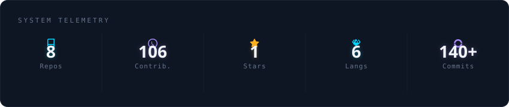

# Daniel Corbe | Go Backend Engineer & Monitoring Systems Architect

**Missão:** Projetar sistemas de monitoramento escaláveis e integrar engenharia de software com observabilidade, IA e boas práticas de backend.

- **Backend & Cloud:** Go, NestJS, FastAPI, AWS, Docker, n8n, PostgreSQL
- **Linguagens:** Go, TypeScript, Python, JavaScript, PHP
- **Monitoramento:** Zen Monitoring, SLO/SLI, Observabilidade, Métricas
- **Full-Stack:** React, Next.js, Node.js, WordPress, Tailwind CSS
- **Experiência:** Backend Architect — Sistemas de Monitoramento | Farm Management APIs | Plataformas Web

---

## Contato & Redes

---

## Stack & Ferramentas

  
  
  
  
  
   
  
  
  
  
  
   
  
  
  
  

---

## Projetos em Destaque

  
  
  
  

---

  

  

 

  

 

  

  <picture>
    <source
      media="(prefers-color-scheme: dark)"
      srcset="https://raw.githubusercontent.com/platane/snk/output/github-contribution-grid-snake-dark.svg"
    />
    <source
      media="(prefers-color-scheme: light)"
      srcset="https://raw.githubusercontent.com/platane/snk/output/github-contribution-grid-snake.svg"
    />
    
  </picture>

